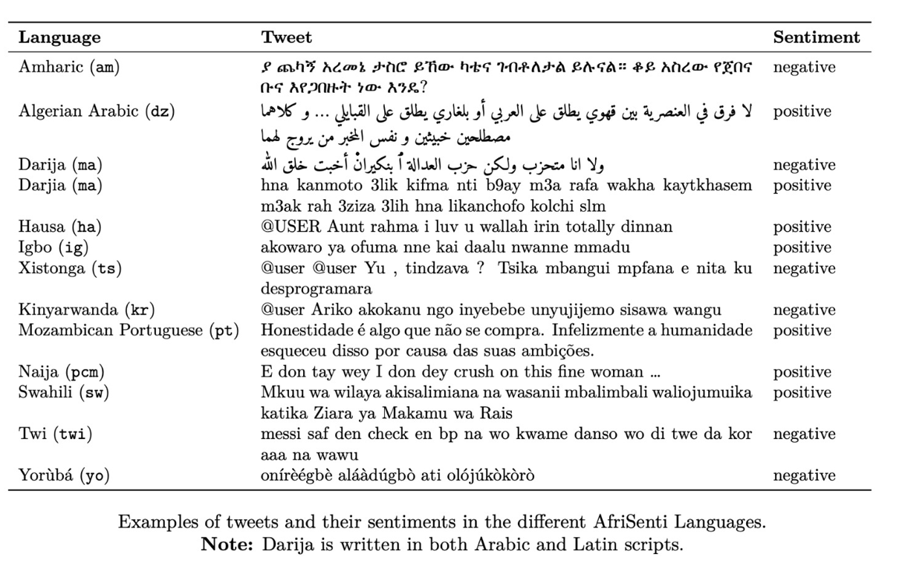

#   **AfriSenti-SemEval Shared Task 12** 
AfriSenti-SemEval: Sentiment Analysis for African Languages

> Part of the [17th International Workshop on Semantic Evaluation](https://semeval.github.io/SemEval2023/tasks.html)

> [Frequently Asked Questions about SemEval Shared Task](https://semeval.github.io/faq.html)

> Contact organizers at: [afrisenti-semeval-organizers@googlegroups.com](mailto:afrisenti-semeval-organizers@googlegroups.com)

> Join [Task Slack Channel](https://join.slack.com/t/afrisenti-semeval/shared_invite/zt-1fds98x1u-L3c~bpBI91IWRD80_Fy23Q) to communicate with the organizers.
> 
>  [Visit CodaLab competition website](https://codalab.lisn.upsaclay.fr/competitions/7320)

      AfriSenti Result is coming soon. Check back again  

---
## **Motivation**

Due to the widespread use of the Internet and social media platforms, most languages are becoming digitally available. This allows for various artificial intelligence (AI) applications that enable tasks such as sentiment analysis, machine translation and hateful content detection. According to UNESCO (2003), 30% of all living languages, around 2,058, are African languages. However, most of these languages do not have curated datasets for developing such AI applications. Recently, various individual and funded initiatives, such as the Lacuna Fund, have set out to reverse this trend and create such datasets for African languages. However, research is required to determine both the suitability of current natural language processing (NLP) techniques and the development of novel techniques to maximize the applications of such datasets.

There has been a growing interest in sentiment analysis which applies to many domains, including public health, commerce/business, art and literature, social sciences, neuroscience, and psychology (<cite>Mohammad, Saif M, 2022</cite>). Previous shared tasks on sentiment analysis include <cite>Mohammad, Saif M et al., (2018), Nakov et al., (2016), Pontiki et al., Ghosh et al., (2015), (2014), and so on</cite>. However, none of these tasks included African languages. Though <cite> Mohammad, Saif, et al. (2018)</cite> included standard Arabic, we focus on Arabic dialects from African countries: <cite>Algerian Arabic</cite> and <cite>Tunisian Arabizi</cite>. We believe SemEval is the right venue, due to its popularity and widespread acceptance, to carry out shared tasks for African languages to strengthen their further development.

In this shared task, we have covered 17 African languages, <a href="https://en.wikipedia.org/wiki/Hausa_language">Hausa</a>, <a href="https://en.wikipedia.org/wiki/Yoruba_language">Yoruba</a>, <a href="https://en.wikipedia.org/wiki/Igbo_language">Igbo</a>, <a href="https://en.wikipedia.org/wiki/Nigerian_Pidgin">Nigerian </a>Pidgin from Nigeria, <a href="https://en.wikipedia.org/wiki/Amharic, and Oromo">Amharic</a>, <a href="https://en.wikipedia.org/wiki/Tigrinya_language">Tigrinya</a>, and <a href="https://en.wikipedia.org/wiki/Oromo_language">Oromo</a> from Ethiopia, <a href="https://en.wikipedia.org/wiki/Swahili_language">Swahili</a> from Kenya and Tanzania, <a href="https://en.wikipedia.org/wiki/Algerian_Arabic">Algerian Arabic</a> dialect from Algeria, <a href="https://en.wikipedia.org/wiki/Kinyarwanda">Kinyarwanda</a> from Rwanda, <a href="https://en.wikipedia.org/wiki/Twi">Twi</a> from Ghana, <a href="https://www.google.com/search?client=safari&amp;rls=en&amp;q=Mozabique+portuguess&amp;ie=UTF-8&amp;oe=UTF-8">Mozambique Portuguese</a> from Mozambique &nbsp;and <a href="https://en.wikipedia.org/wiki/Moroccan_Arabic">Moroccan Arabic/Darija</a> from Morocco.

## **Task Overview**

The <strong>AfriSenti-SemEval Shared Task 12</strong> is based on a collection of Twitter datasets in 14 African languages for sentiment classification. It consists of three sub-tasks. Participants can select one or more sub-tasks depending on their preference. In each sub-task also, the participant may wish to participate in any number of languages as so wished.

<blockquote>

<strong>Task A: Monolingual Sentiment Classification</strong>

</blockquote>

Given training data in a target language, determine the polarity of a tweet in the target language (positive, negative, or neutral). If a tweet conveys both a positive and negative sentiment, whichever is the stronger sentiment should be chosen. This sub-task has 15 tracks:

<strong>Note: You are free to select one or more tracks in this sub-task. </strong>

<ul>
<li>Track 1: Hausa&nbsp;</li>
<li>Track 2: Yoruba</li>
<li>Track 3: Igbo</li>
<li>Track 4: Nigerian_Pidgin</li>
<li>Track 5: Amharic</li>
<li>Track 6: Algerian Arabic</li>
<li>Track 7: Moroccan Arabic/Darija,</li>
<li>Track 8: Swahili</li>
<li>Track 9: Kinyarwanda</li>
<li>Track 10: Twi</li>
<li>Track 11: Mozambican Portuguese</li>
<li>Track 12: Xitsonga&nbsp;(<strong>Mozambique Dialect</strong>)</li>
<li>Track 13: Setswana (data to be released soon)</li>
<li>Track 14: isiZulu (data to be released soon)</li>
<li>Track 15: Xitsonga (South-African Dialect, to be released soon)</li>
</ul>

<strong>Note: Tweets in each language are code-mix. Read our <a href="https://arxiv.org/pdf/2201.08277.pdf">NaijaSenti</a> paper for more information.</strong>

<blockquote>

<strong>Task B: Multilingual Sentiment Classification</strong>

</blockquote>

Given combined training data from Task-A (Track 1 to 12), determine the polarity of a tweet in the target language (positive, negative, or neutral). This sub-task has only one track with 12 languages <strong style="color: blue;">(Hausa, Yoruba, Igbo, Nigerian_Pidgin, Amharic, Algerian Arabic, Moroccan Arabic/Darija, Swahili, Kinyarwanda, Twi, Mozambican Portuguese, and Xitsonga(<strong>Mozambique Dialect</strong>)):</strong>

<ul>
<li>Track 16: 12 languages in Task A</li>
</ul>
<blockquote>

<strong>Task C: Zero-Shot Sentiment Classification</strong>

</blockquote>

Given unlabelled tweets in two African languages (Tigrinya and Oromo), leverage any or all of the available training datasets (in Task:A ) to determine the sentiment of a tweet in the two target languages. This task has two (2) tracks.

<strong>Note: You are free to select one or more tracks in this sub-task.</strong>

<ul>
<li>Track 17: Zero-Shot on Tigrinya</li>
<li>Track 18: Zero-Shot on Oromo</li>
</ul>
## **Dataset Examples**

The dataset involves tweets labeled with three sentiment classes (positive, negative, neutral) in 14 African languages. Each tweet is annotated by three annotators following the annotation guidelines in (<cite>Mohammad, Saif M, 2016</cite>). We use a form of majority vote to determine the sentiment of the tweet. See more in our paper (<cite>Muhammad et al., 2022</cite>, <cite>Yimam et al., 2020</cite>). Below is a sample dataset for the 4 Nigerian languges (Muhammad et al., 2022):

The datasets are available via the [CodaLab competition website](https://codalab.lisn.upsaclay.fr/competitions/7320)

## Starter kit

We provide a <a href="https://github.com/afrisenti-semeval/afrisent-semeval-2023">Starter Ki</a>t on our GitHub Repo that can be used to crearte a baseline system.

## Why Participate ?

<ul>
<li>Promote NLP research involving African languages,</li>
<li>Opportunity to write a system-description paper that describes their system, resources used, results, and analysis.</li>
<li>Stand a chance to win an award.</li>
<li>Opportunity to network with renowned experts in the AI and NLP community.</li>
</ul>

<strong style="font-size: 1.5em;">Resources on Paper Submission</strong>

<ul>
<li><a href="https://semeval.github.io/paper-requirements.html">Paper Submission Requirements</a></li>
<li><a href="https://semeval.github.io/system-paper-template.html">Guidelines for Writing Papers</a></li>
<li><a href="https://github.com/acl-org/acl-style-files">Paper Style Files</a></li>
<li>Paper Submission Site (TBD)</li>
</ul>

## **Important Dates**

| Descriptions |  Deadlines |
| --- | --- |
| Sample Data Ready  | <s>15 July 2022</s>|
| Training Data Ready |<s> 11 September 2022</s>|
| Evaluation Start  | <s>10 January 2023</s>|
| Evaluation End  | <s>31 January 2023</s>|
| System Description Paper Due |  ebruary 2023   |
| Notification to authors   | March 2023    |
| Camera ready due   | April 2023 |
| SemEval workshop 2023  |(co-located with ACL 2023 Canada) |

All deadlines are 23:59 UTC-12 ("anywhere on Earth").

## **Communication**

- Join [Task Mailing List](https://groups.google.com/g/afrisenti-semeval)
- Join [Task Slack Channel](https://join.slack.com/t/afrisenti-semeval/shared_invite/zt-1fds98x1u-L3c~bpBI91IWRD80_Fy23Q) to communicate with the organizers.
- Contact Organizers: [afrisenti-semeval-organizers@googlegroups.com](mailto:afrisenti-semeval-organizers@googlegroups.com)
## **Previous Shared Tasks**

1. Shared tasks in English:[SemEval-2017](https://alt.qcri.org/semeval2017/task4/),[SemEval-2016](https://alt.qcri.org/semeval2016/task4/),[SemEval-2015](https://alt.qcri.org/semeval2015/task10/),[SemEval-2014](https://alt.qcri.org/semeval2014/task9/),[SemEval-2013](https://aclanthology.org/S13-2052/)

2. Shared tasks in Spanish [TASS-2017](http://www.sepln.org/workshops/tass/2017/),[TASS-2016](http://www.sepln.org/workshops/tass/2016/tass2016.php),[TASS-2015](http://www.sepln.org/workshops/tass/2015/tass2015.php),[TASS-2014](http://www.sepln.org/workshops/tass/2014/tass2014.php),[TASS-2013](https://competitions.codalab.org/competitions/17751#learn_the_details-overview),[TASS-2012](http://www.sepln.org/workshops/tass/2012/tasks.php).

## References

   1. UNESCO. 2003. Sharing the world of difference. UNESCO.
   2. Mohammad, Saif M. "Ethics sheet for automatic emotion recognition and sentiment analysis." Computational Linguistics 48.2 (2022): 239-278.
   3. Preslav Nakov, Sara Rosenthal, Svetlana Kiritchenko, Saif M Mohammad, Zornitsa Kozareva, Alan Ritter, Veselin Stoyanov, and Xiaodan Zhu. 2016. Developing a successful SemEval task in sentiment analysis of twitter and other social media texts. Language Resources and Evaluation, 50(1):35–65.
   4. Mohammad, Saif, et al. "Semeval-2018 task 1: Affect in tweets." Proceedings of the 12th international workshop on semantic evaluation. 2018.
   5. Maria Pontiki, Dimitris Galanis, John Pavlopoulos, Harris Papageorgiou, Ion Androutsopoulos, Suresh Manandhar. 2014: SemEval-2014 Task 4: Aspect Based Sentiment Analysis, Dublin, Ireland
   6. Saif Mohammad. 2016. A Practical Guide to Sentiment Annotation: Challenges and Solutions. In Proceedings of the 7th Workshop on Computational Approaches to Subjectivity, Sentiment and Social Media Analysis, pages 174–179, San Diego, California. Association for Computational Linguistics.
   7. Aniruddha Ghosh, Guofu Li, Tony Veale, Paolo Rosso, Ekaterina Shutova, John Barnden, Antonio Reyes. 2015: SemEval-2015 Task 11: Sentiment Analysis of Figurative Language in Twitter, Denver, Colorado
   8. Shamsuddeen Hassan Muhammad, David Ifeoluwa Adelani, Sebastian Ruder, Ibrahim Said Ahmad, Idris Abdulmumin, Bello Shehu Bello, Monojit Choudhury, Chris Chinenye Emezue, Saheed Salahudeen Abdullahi, Anuoluwapo Aremu, Alipio Jeorge, Pavel Brazdil. 2022, NaijaSenti: A Nigerian Twitter Sentiment Corpus for Multilingual Sentiment Analysis, Marseille, France
   9. Seid Muhie Yimam, Hizkiel Mitiku Alemayehu, Abinew Ayele, Chris Biemann. 2020: Exploring Amharic Sentiment Analysis from Social Media Texts: Building Annotation Tools and Classification Models, Barcelona, Spain (Online)

