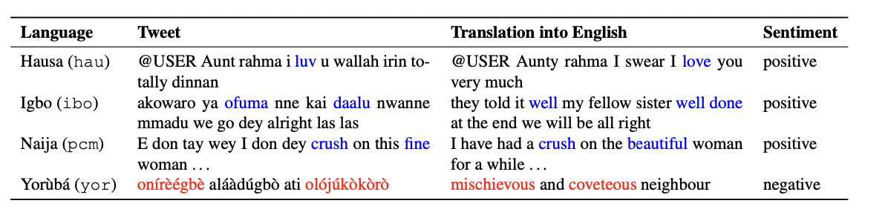

#   **AfriSenti-SemEval Shared Task 12** 
AfriSenti-SemEval: Sentiment Analysis for Low-resource African Languages using Twitter Dataset

---

## **Motivation**

Due to the widespread use of the Internet and social media platforms, most languages are becoming digitally available. This allows for various artificial
intelligence (AI) applications that enable tasks such as sentiment analysis, machine translation, hateful content detection, among others. According to UNESCO (2003), 30% of all living languages, around 2,058, are African languages. However, most of these languages do not have curated datasets for developing such AI applications. Recently, various individual and funded initiatives, such as the Lacuna Fund, have set out to reverse
this trend and create such datasets for African languages. However, research is required to determine both the suitability of current natural language processing (NLP) techniques and the development of novel techniques to maximize the applications of such datasets. We believe that SemEval is the right venue, due to its popularity and widespread acceptance, to carry out shared tasks in these African languages to strengthen their further development

## **Task Overview**

Previous shared tasks on multilingual sentiment analysis includes ()....... However, none of these tasks have covered African languages. The AfriSenti-SemEval shared task is based on a collection of Twitter datasets in 12 African languages for sentiment classification. The AfriSenti-SemEval consists of three sub-tasks.

The AfriSenti-SemEval consists of three sub-tasks. Participants can select one or more tasks depending on their preference. 

> **Task A: Monolingual Sentiment Classification:**
> Given training data in a target language, determine whether an instance of tweet in that language is positive, negative, or neutral

> **Task B: Sentiment  Multilingual Sentiment Classification**

Given a combined training data from 10 African languages, determine whether a tweet instance in any of the given languages is positive, negative, or neutral.

> **Task C: Zero-Shot Sentiment Classification**

Given unlabeled tweets in two African languages (Tigrinya and isiZulu,leverage any or all of the available training datasets in Subtasks 1 and 2 to determine whether an instance of tweet in the two target languages is positive, negative, or neutral.

## Previous Shared Tasks

## **Dataset Examples**

The dataset involves tweets labeled with three sentiment classes (positive, negative, neutral) in 12 African languages. Each tweet is annotated by three annotators. We use a form of majority vote to determine the sentiment of the tweet. See more in our paper: Below is a sample dataset in all the languages:

The datasets are available on [Github](https://github.com/afrisenti-semeval/afrisent-semeval-dataset)

## **Important Dates**

| Descriptions |  Deadlines |
| --- | --- |
| Sample Data Ready  | 15 July 2022 |
| Training Data Ready | 1 September 2022 |
| Evaluation Start  | 10 January 2023|
| Training Data Ready | 1 September 2022 |
| System Description Paper Due |  February 2023  |
| Notification to authors   | March 2023   |
| Camera ready due   | April 2023  |
| SemEval workshop Summer 2023  |(co-located with a major NLP conference) | 

## **Communication**

- Task Mailing List 
- Task Slack Channel
- Task Organizers email

